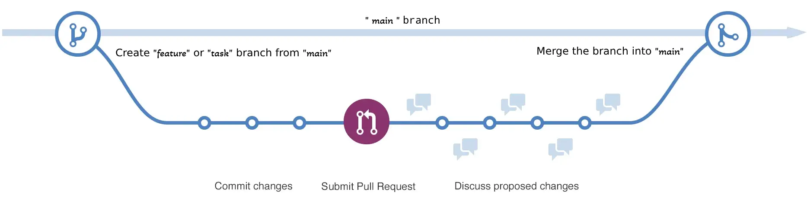

A clear branching strategy is essential for any software project to prevent the chaos of direct commits to the `main` branch. Working directly on `main` can lead to frequent merge conflicts, broken builds, and lost code, especially in a team setting.

The solution is to use short-lived branches for every new piece of work, whether it's a feature, bugfix, or chore. While there are many branching strategies, I recommend a strategy based on the popular and straightforward **[GitHub Flow](https://docs.github.com/en/get-started/using-github/github-flow)**. It's simple to understand, promotes continuous delivery, and works exceptionally well for most projects.

The core idea is illustrated below:

**Branch Types Explained**

- **Main Branch (`main`)**: This is the stable branch that always reflects the latest production-ready state of your project. All releases and deployments are made from here.
- **Feature branches (`feature-*` or `task-id-*`)**: Used for developing new features, enhancements, bug fixings or tasks. If you use a task management tool (like Jira), you can integrate with it and name your branch after the task or ticket ID (e.g., `ab-123-add-login`). Each feature/task branch is short-lived and merged back into `main` via a pull request after review and testing.

This model also supports different development environments with ease. When you complete a feature or task, you open a pull request (**PR**). You can configure a GitHub Action (or any other CI/CD service) to run tests and automate the generation of **APK**s for Android and **IPA**s for iOS, and distribute them to testers or users via your chosen platforms. I’ll cover _Flutter Continuous Delivery (CD)_ in detail in a future article.

:::tip[Git & Github Cheat Sheet]
I assume you already know the basics of Git and GitHub, so I won’t include basic Git commands here. If you need a refresher, check out my [Git & GitHub Cheatsheet](../../git-github-cheat-sheet/) article.
:::

:::important[Git Merge Recommendation]
If you merge branches locally, `merge --no-ff` is highly recommended. The `--no-ff` flag causes the merge to always create a new commit object, even if the merge could be performed with a fast-forward. This avoids losing information about the historical existence of a feature branch and groups all commits that together added the feature.
:::
