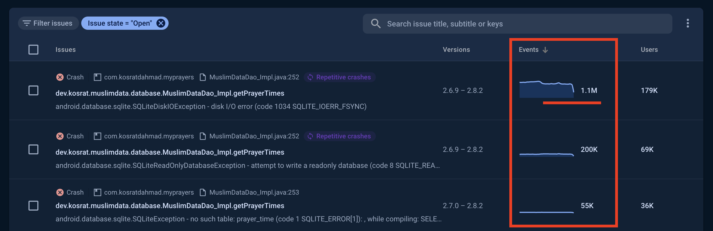
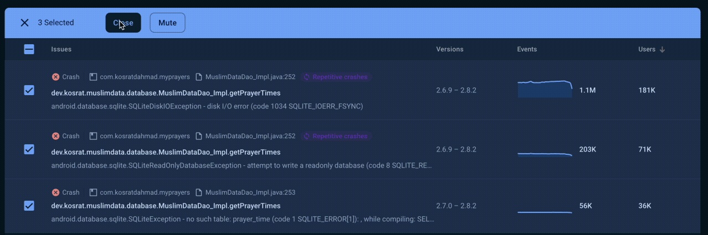

## Overview 
A decade ago, I noticed a gap in our local Muslim community. People couldn't use the available prayer apps because we used fixed prayer times instead of auto-calculated ones. So, I started developing a prayer app named **MyPrayers** that offers both fixed and auto-calculated prayer times, Azkars, Qibla direction, Names of Allah, and more. The **MyPrayers** app has been published on [Google Play](https://play.google.com/store/apps/details?id=com.kosratdahmad.myprayers&pcampaignid=web_share), [AppGallery](https://appgallery.huawei.com/app/C101066833), and the [App Store](https://apps.apple.com/us/app/my-prayers/id1390015257).

Since then, I've aimed to create an Android and iOS dependency to provide this data with just a few lines of code, supporting anyone who wants to build Muslim apps. In 2020, I started creating an open-source dependency for both Android and iOS platforms named [`muslim-data-android`](https://github.com/kosratdev/muslim-data-android) and [`muslim-data-ios`](https://github.com/kosratdev/muslim-data-ios), containing all the data that a prayer app needs.

## Android Prepopulated Room Database
The `muslim-data-android` uses a local database for the fixed Prayer Times, Names of Allah, and Azkars. As part of the Android Jetpack libraries, Room is recommended to use local Android databases. It also supports prepopulated databases.

> The Room persistence library provides an abstraction layer over SQLite to allow for more robust database access while harnessing the full power of SQLite.
>
> *From Room Documentation*


After thoroughly reviewing the Room documentation and various published articles, I came across a useful code snippet for utilizing a prepopulated database with Room. This approach allows us to manage a local prepopulated database within your Android application.
```kotlin
@Database(
    entities = [...],
    version = 1,
)
abstract class MuslimDataDatabase : RoomDatabase() {
    internal abstract val muslimDataDao: MuslimDataDao

    companion object {

        @Volatile
        private var INSTANCE: MuslimDataDatabase? = null

        fun getInstance(context: Context): MuslimDataDatabase {
            synchronized(this) {
                var instance = INSTANCE
                if (instance == null) {
                    instance = Room.databaseBuilder(
                        context.applicationContext, MuslimDataDatabase::class.java,
                        "muslim_db.db"
                    )
                        .createFromAsset("database/muslim_db_v2.0.1.db")
                        .fallbackToDestructiveMigration()
                        .build()

                    INSTANCE = instance
                }

                return instance
            }
        }
    }
}
```

It is very simple and straight forward. It uses a singleton pattern to ensure only one instance of the database exists, using `Room.databaseBuilder` to build the database from an asset (`muslim_db_v2.0.1.db`) and apply a fallback strategy for destructive migrations. I’ve used it and tested on both different emulators and physical devices. All works as expected without any issues.

## 1M Crash Events 💣💥
After successfully publishing and integrating `muslim-data-android` in the **MyPrayers** app, I’ve received some unusual crashes in Firebase Crashlytics. These include `SQLiteDiskIOException`, `SQLiteReadOnlyDatabaseException`, and `SQLiteException`, all originating from the `muslim-data-android` dependency.

**Sample of The Crash**
```kotlin
Fatal Exception: android.database.sqlite.SQLiteDiskIOException: disk I/O error (code 1802 SQLITE_IOERR_FSTAT): , while compiling: PRAGMA journal_mode
at android.database.sqlite.SQLiteConnection.nativePrepareStatement(SQLiteConnection.java)
at android.database.sqlite.SQLiteConnection.acquirePreparedStatement(SQLiteConnection.java:1068)
at android.database.sqlite.SQLiteConnection.executeForString(SQLiteConnection.java:811)
at android.database.sqlite.SQLiteConnection.setJournalMode(SQLiteConnection.java:419)
at android.database.sqlite.SQLiteConnection.setJournalFromConfiguration(SQLiteConnection.java:339)
...
at android.database.sqlite.SQLiteDirectCursorDriver.query(SQLiteDirectCursorDriver.java:46)
at android.database.sqlite.SQLiteDatabase.rawQueryWithFactory(SQLiteDatabase.java:1718)
at android.database.sqlite.SQLiteDatabase.rawQueryWithFactory(SQLiteDatabase.java:1693)
at androidx.sqlite.db.framework.FrameworkSQLiteDatabase.query(FrameworkSQLiteDatabase.kt:156)
at androidx.room.RoomDatabase.query(RoomDatabase.kt:484)
at androidx.room.util.DBUtil.query(DBUtil.kt:75)
at dev.kosrat.muslimdata.database.MuslimDataDao_Impl.getPrayerTimes(MuslimDataDao_Impl.java:196)
at dev.kosrat.muslimdata.repository.MuslimRepository$getPrayerTimes$2.invokeSuspend(MuslimRepository.kt:56)
...
```
Furthermore, some users mentioned that when they close and reopen the app, it crashes. The tricky part is that I couldn’t reproduce it on my end. I’ve carefully reviewed and optimized all the database-related code, including data class entities, DAOs, queries, joins, etc. Despite publishing 3 versions, the issue persists and has reached 1 million crash events, as shown below.


After a long debugging and testing session, I finally discovered what was causing the issue 💪😎. It turns out it's all related to getting the database instance.
```kotlin
instance = Room.databaseBuilder(
            context.applicationContext,
            MuslimDataDatabase::class.java,
            "muslim_db.db"
            )
            .createFromAsset("database/muslim_db_v2.0.1.db")
            .fallbackToDestructiveMigration()
            .build()
```
This code snippet recreates the database from the asset every time the app is opened. This can lead to crashes if the database connection is already open. When you close the app, the database singleton instance will be destroyed, but the database connection may not be closed depending on the strategy of the Android OS. When you reopen the app, a crash can occur because it attempts to recreate an already open database.

## The Right Way of Prepopulating Room Database
Unfortunately, none of the articles or Room documentation I’ve read describe this type of issue, even though they prefer to use it that way. Since the root cause of the issue has been detected, I’ve come up with a solution for a prepopulated Room database by using a condition to recreate the database based on its existence.
```kotlin
...
fun getInstance(context: Context): MuslimDataDatabase {
    synchronized(this) {
        var instance = INSTANCE
        if (instance == null) {
            val dbName = "muslim_db.db"
            val dbBuilder = Room.databaseBuilder(
                context.applicationContext,
                MuslimDataDatabase::class.java,
                dbName
            ).fallbackToDestructiveMigration()

            **// Copy database if it doesn't exist.
            val dbFile = context.getDatabasePath(dbName)
            if (!dbFile.exists()) {
                dbBuilder.createFromAsset("database/muslim_db_v2.1.0.db")
            }**

            instance = dbBuilder.build()

            INSTANCE = instance
        }
        return instance
    }
}
...
```
Now, this is the right way to use a prepopulated Room database 🎉🎊. It won't recreate the database from the asset every time the app is opened. When you get an instance from the database, it checks whether the database exists. If it does, it will connect to it; otherwise, it will create the database from the asset.

## What about Database Migrations?
Room database migrations are another thing we need to consider once we have a Room database. The Room documentation explains the migrations in detail, as linked below, except for one scenario: What if I want to migrate my Room database using a prepopulated database from the asset?

[Migrate your Room database  |  Android Developers](https://developer.android.com/training/data-storage/room/migrating-db-versions)

In our specific case, sometimes we need to update prayer times for a city, which involves modifying 366 records at once. It's not feasible to manage this task using normal migrations, so we must make changes directly to the prepopulated database and then recreate the Room database from the asset.
We need to perform these tasks before getting or while getting the Room instance, similar to the initial database creation. To achieve this, we must identify any database version changes and then recreate it from the asset, as shown below.
```kotlin
...
if (!dbFile.exists() || isVersionChanged(context)) {
		dbBuilder.createFromAsset("database/muslim_db_v2.1.0.db")
}
```

The `isVersionChanged` method checks for changes in the database version to see if it has been updated. In Room database, versioning is used for migrations, so we can store the version in shared preferences and compare it each time we get a new instance. If it has changed, the method returns true; if not, it returns false. Additionally, we have used `fallbackToDestructiveMigration` and provided no migrations, so the Room database will be recreated from the asset in this case.

**Here is the `isVersionChanged` method**
```kotlin
private const val DB_VERSION = 1

@Database(
    entities = [...],
    version = DB_VERSION,
)
abstract class MuslimDataDatabase : RoomDatabase() {
    internal abstract val muslimDataDao: MuslimDataDao

    companion object {
				...
				...
		
				private fun **isVersionChanged**(context: Context): Boolean {
						val pref = PreferenceManager.getDefaultSharedPreferences(context)
				    val savedVersion = pref.getInt("DB_VERSION", 1)
				    if (savedVersion < DB_VERSION) {
				        pref.edit { putInt("DB_VERSION", DB_VERSION) }
				        return true
				    }
				    return false
				}
		}
}
```

## All Together
The following snippet code shows the right way to use a prepopulated database from the asset and considering data migrations from the asset too.
```kotlin
private const val DB_VERSION = 1

@Database(
    entities = [...],
    version = DB_VERSION
)
abstract class MuslimDataDatabase : RoomDatabase() {
    internal abstract val muslimDataDao: MuslimDataDao

    companion object {

        @Volatile
        private var INSTANCE: MuslimDataDatabase? = null

        fun getInstance(context: Context): MuslimDataDatabase {
            synchronized(this) {
                var instance = INSTANCE
                if (instance == null) {
                    val dbName = "muslim_db.db"
                    val dbBuilder = Room.databaseBuilder(
                        context.applicationContext,
                        MuslimDataDatabase::class.java,
                        dbName
                    ).fallbackToDestructiveMigration()

                    val dbFile = context.getDatabasePath(dbName)
                    if (!dbFile.exists() || isVersionChanged(context)) {
                        dbBuilder.createFromAsset("database/muslim_db_v2.1.0.db")
                    }

                    instance = dbBuilder.build()

                    INSTANCE = instance
                }
                return instance
            }
        }

        private fun isVersionChanged(context: Context): Boolean {
						val pref = PreferenceManager.getDefaultSharedPreferences(context)
				    val savedVersion = pref.getInt("DB_VERSION", 1)
				    if (savedVersion < DB_VERSION) {
				        pref.edit { putInt("DB_VERSION", DB_VERSION) }
				        return true
				    }
				    return false
				}
    }
}

```

Finally we fixed the million crash events 🎉🎊💪


In wrapping up, using the Room with prepopulated databases in Android applications provides a great way to manage local databases with ease. By following the recommended approach and using the provided code snippets, developers can avoid the crashes that happened to me. Their apps will be safer, more efficient, and more reliable.

Happy Coding!