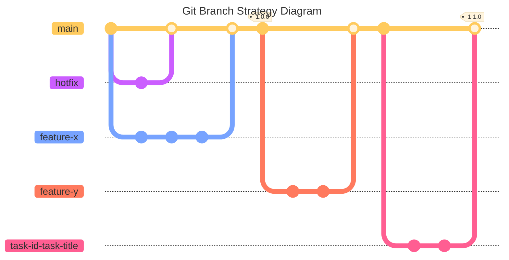
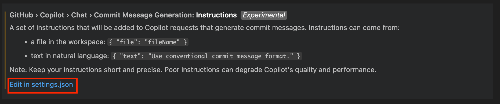
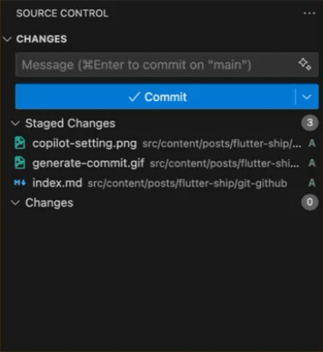

# Overview

Twenty years ago, **Git** emerged as a version control system (VCS) to facilitate teamwork and track changes in a version history. Nowadays, Git is an essential tool for software developers, especially for those working in a team. Complementing Git, platforms like **GitHub** provide hosting for Git repositories, enabling collaboration and sharing.

In this post, I will show you how to setup a **production-ready Git & GitHub workflow** for your project. As you may know, this article is a part of the [**Flutter Ship**](../) series, which guides you in shipping a production-ready Flutter app. However, the principle discussed can be applied on **other languages or frameworks**.

By the end of this article, you will learn the following:

1.  How to establish a robust **branching strategy** for different environments.
2.  How to adopt a **commit message standard** for a clean history and automated changelogs.
3.  How to automatically generate and manage **project changelogs**.
4.  How to use **Git hooks** to automate local checks, like formating & linting files, linting commits, and running tests.
5.  How to implement a **CI/CD pipeline** with **GitHub Actions** to automate your workflow.

If this sounds like what you're looking for, let's dive in!

# Branch Strategy

A clear branching strategy is essential for any software project to prevent the chaos of direct commits to the `main` branch. Working directly on `main` can lead to frequent merge conflicts, broken builds, and lost code, especially in a team setting.

The solution is to use short-lived branches for every new piece of work, whether it's a feature, bugfix, or chore. While there are many branching strategies, I recommend a strategy based on the popular and straightforward **[GitHub Flow](https://docs.github.com/en/get-started/using-github/github-flow)**. It's simple to understand, promotes continuous delivery, and works exceptionally well for most projects.

The core idea is illustrated below:



**Branch Types Explained**

- **Main Branch (`main`)**: This is the stable branch that always reflects the latest production-ready state of your project. All releases and deployments are made from here.
- **Feature branches (`feature-*` or `task-id-*`)**: Used for developing new features, enhancements, or tasks. If you use a task management tool (like Jira), you can name your branch after the task or ticket ID (e.g., `ab-123-add-login`). Each feature/task branch is short-lived and merged back into `main` via a pull request after review and testing.
- **Hotfix branches (`hotfix-*`)**: Created to quickly address critical bugs or issues found in production. Hotfixes are merged back into `main` as soon as the fix is verified.

This model also supports different development environments with ease. When you complete a feature or task, you open a pull request (PR). You can configure a GitHub Action (or any other CI/CD service) to run tests and deploy the branch to a preview environment, such as `feature-x.example.com`, for internal review by developers or QA engineers.

After the PR is merged, you can trigger a job to deploy the changes to a staging environment. This allows other departments or clients to provide feedback or report issues. Finally, deploying to production is as simple as tagging the `main` branch.

For mobile projects, while you can't deploy preview environments like you can for web apps, you can automate the generation of **APK**s for Android and **IPA**s for iOS, and distribute them to testers or users via your chosen platforms. I’ll cover Flutter Continuous Delivery (CD) in detail in a future article.

:::tip[Git & Github Cheat Sheet]
I assume you already know the basics of Git and GitHub, so I won’t include basic Git commands here. If you need a refresher, check out my [Git & GitHub Cheatsheet](../../git-github-cheat-sheet/) article.
:::

:::important[Git Merge Recommendation]
If you merge branches locally, `merge --no-ff` is highly recommended. The `--no-ff` flag causes the merge to always create a new commit object, even if the merge could be performed with a fast-forward. This avoids losing information about the historical existence of a feature branch and groups together all commits that together added the feature.
:::

# Commit Messages

Commit messages are your working history. While the probability of reading them is low, they are still valuable for maintaining a good commit history and understanding changes later on. At least once in a while, you need to read the history to get more details about an emerging issue. Furthermore, in most software projects, the changelog will be generated based on those commit messages to show the release changes between versions. So what could you find or generate if you have the following history?

```bash title="git log --graph --online"
* 4dcd0dc fix color
* 1e0acd7 fix issue
* 897cab6 Merge branch 'add-comment'
|\  
| * 7b2c3f3 integration
|/  
* 3d0b48d add feature
* 7287225 updated
* 1405829 update post
* dba0ea9 add post
```

To have team-level agreed standards for git commit messages, I highly recommend following **[Conventional Commits](https://www.conventionalcommits.org)**. 

```bash title="Conventional Commit Message Structure"
<type>[optional scope]: <description>

[optional body]

[optional footer(s)]
```

Check out the following example that uses conventional commit messages, which are much easier to understand and allow you to easily generate changelogs:

```bash title="git log --graph --online"
* 4dcd0dc Update themeColor fixed property to true
* 1e0acd7 fix(comment): Update check script to include biome CI
* 897cab6 Merge branch 'add-comment'
|\  
| * 7b2c3f3 feat(comment): Integrate Giscus for comments and add styles
|/  
* 8cbd821 fix(dependencies): Update astro and biome versions in pnpm-lock.yaml
* 3d0b48d feat: Add support for rendering mermaid codes in the markdown files
* 7287225 ci: Update code quality job
* 1405829 refactor(post): Update muslim data post and released
* dba0ea9 feat(post): Add the first draft of muslim data post
* 31a1ef8 build: Remove astro compress
```

## Common Commit Types

Here's a quick reference for the most common conventional commit types with Flutter/mobile development examples:

| Type | Description | Example |
|------|-------------|---------|
| `feat` | New feature | `feat(auth): add biometric login support` |
| `fix` | Bug fix | `fix(ui): resolve keyboard overflow on login screen` |
| `docs` | Documentation | `docs: update README with Firebase setup instructions` |
| `style` | Code style changes | `style: format code with dart format` |
| `refactor` | Code refactoring | `refactor(api): simplify HTTP client implementation` |
| `test` | Adding tests | `test(auth): add unit tests for login validation` |
| `chore` | Maintenance tasks | `chore: update Flutter SDK to 3.24.0` |
| `perf` | Performance improvements | `perf(list): optimize ListView rendering for large datasets` |
| `build` | Build system changes | `build: update Android Gradle Plugin to 8.1.0` |
| `ci` | CI/CD changes | `ci: add automated APK generation workflow` |

## Breaking Changes

For breaking changes, add `!` after the type or include `BREAKING CHANGE:` in the footer:

```bash
feat!: migrate to Material Design 3

BREAKING CHANGE: Updated theme system requires manual migration of custom colors. See migration guide in docs/migration.md
```

## AI-Generated Commit Messages

There are many tools that can help you write better conventional commits, and there are also AI tools to generate them. I've used various tools to generate commit messages, but recently I started using **GitHub Copilot** to generate conventional commit messages. By default, Copilot doesn't generate conventional commit messages, so we need to set a custom prompt in the settings.

### VSCode Copilot Configuration for Commit Messages

If you're using VS Code with workspace-based settings, you can find the settings file at `your-project > .vscode > settings.json`. For user-based settings, navigate to: 
**Settings > Extensions > GitHub Copilot Chat > Commit Message Generation**



After you find the settings, add the following prompt to generate conventional commit messages:

```bash title="Copilot Generate Commit Message Prompt"
// ...existing settings

"github.copilot.chat.commitMessageGeneration.instructions": [  
  {
    "text": "Generate a commit message that MUST follow the Conventional Commits format (feat, fix, docs, style, refactor, test, perf, build, ci, chore, revert). Include a brief description of the change in the subject line (under 72 characters) and a summarized explanation in the body with around 200 characters, if necessary. Separate the subject and body with a blank line. Example: 'feat(feature): Add new feature description' or 'fix(bug): Fix a bug in the project'."
  }
]

// ...existing settings
```

Now you can generate it with one click! 🎉



### Alternative Tools

Besides GitHub Copilot, here are other popular tools for conventional commits:

- **[Commitizen](https://github.com/commitizen/cz-cli)**: Interactive CLI tool that guides you through creating conventional commits.
- **[Conventional Commits VS Code Extension](https://marketplace.visualstudio.com/items?itemName=vivaxy.vscode-conventional-commits)**: GUI helper for VS Code users.
- **[Cocogitto](https://github.com/cocogitto/cocogitto)**: The Conventional Commits toolbox.
- **[AI Commits](https://github.com/Nutlope/aicommits)**: A CLI that writes your git commit messages for you with AI.
- **More**: You can find more on the [conventional commits](https://www.conventionalcommits.org/en/about/) about page.

# Changelog

A `CHANGELOG.md` is a way to tell your consumers what has changed between versions. One of the most effective ways to do this is to generate it based on your git commit messages, which contain all your change history. There are many tools for generating changelogs, but one of my favorite tools is **[Git Cliff](https://git-cliff.org)**, which is a highly customizable changelog generator. It only takes three simple steps from installation to generation, as explained below:

## Setup Git Cliff

1. **Installation**: It supports most package managers, so you can find your preferred one [here](https://git-cliff.org/docs/installation). I use macOS, so I installed it via Homebrew:

```bash title="Install Git Cliff"
brew install git-cliff
```

2. **Initialization**: After installation, navigate to your project and initialize it by running the following command, which creates a file named `cliff.toml` for further customization:

```bash title="Initialize Cliff"
git-cliff --init
```

3. **Generate**: Finally, it's ready to generate a changelog by running the following command:

```bash title="Generate CHANGELOG.md"
git-cliff -o CHANGELOG.md
```

That's all you need to generate a changelog! [Here's an example](https://github.com/my-prayers/muslim-data-flutter/blob/main/CHANGELOG.md) that has been generated by Git Cliff. If you need any further customization, you can simply open and edit the `cliff.toml` file.

## Common Customizations

I've picked some useful customizations from the `cliff.toml` to explain here:

### 1. Update the Header Description

```toml title="cliff.toml"
[changelog]
# template for the changelog header
header = """
# Changelog\n
All notable changes to this project will be documented in this file.\n
"""
# ...existing config
```

### 2. Support Conventional and Non-Conventional Commits

```toml title="cliff.toml"
# ...existing config

[git]
# parse the commits based on https://www.conventionalcommits.org
conventional_commits = true
# filter out the commits that are not conventional
filter_unconventional = true
# process each line of a commit as an individual commit
split_commits = false

# ...existing config
```

### 3. Customize Group Ordering

```toml title="cliff.toml" {9}
# ...existing config

# regex for parsing and grouping commits
commit_parsers = [                                            # Group Ordering
  { message = "^feat", group = "<!-- 0 -->🚀 Features" },     # 0 
  { message = "^fix", group = "<!-- 1 -->🐛 Bug Fixes" },     # 1
  { message = "^doc", group = "<!-- 3 -->📚 Documentation" }, # 3
  { message = "^perf", group = "<!-- 4 -->⚡ Performance" },   # 4
  { message = "^refactor", group = "<!-- 2 -->🚜 Refactor" }, # 2 <- ordered to 2
  { message = "^style", group = "<!-- 5 -->🎨 Styling" },
  { message = "^test", group = "<!-- 6 -->🧪 Testing" },
  # ...
]

# ...existing config
```

### 4. Skip Specific Commit Groups

```toml title="cliff.toml" {10}
# ...existing config

# regex for parsing and grouping commits
commit_parsers = [
  # ...
  { message = "^perf", group = "<!-- 4 -->⚡ Performance" },
  { message = "^refactor", group = "<!-- 2 -->🚜 Refactor" },
  { message = "^style", group = "<!-- 5 -->🎨 Styling" },
  { message = "^test", group = "<!-- 6 -->🧪 Testing" },
  { message = "^chore\\(release\\)", skip = true }, # <-- skipped group
  # ...
]

# ...existing config
```

### 5. Sort Commits by Date

```toml title="cliff.toml"
# ...existing config

# Organize commits within sections by oldest or newest order
sort_commits = "oldest"
```

For more advanced customizations, check out the [Git Cliff documentation](https://git-cliff.org/docs/).

# Git Hooks

> Git hooks are scripts that automatically execute before or after specific Git actions, like committing, pushing, or merging. They allow you to customize Git's behavior, automate tasks, enforce policies, and streamline your workflow. [read more](https://githooks.com)

We can take advantage of Git hooks to automate the following tasks:

1.  **`pre-commit`**: Before a commit is created.
    -   Apply `dart fix` to automatically fix issues.
    -   Apply `dart format` to reformat staged files.
    -   Run the Flutter linter to check for analysis issues.
2.  **`commit-msg`**: After a commit message is written, but before the commit is created.
    -   Validate the commit message to ensure it follows the Conventional Commits standard.
3.  **`pre-push`**: Before pushing code to a remote repository.
    -   Run all Flutter tests to prevent pushing broken code.

:::tip[Keep Git Hooks Fast and Reliable]
Regarding the `pre-push` hook, if you have a large test suite that makes your `git push` command too slow, you can skip this hook and set up a PR check in your CI/CD pipeline as an alternative.
:::

## The Challenge with Manual Git Hooks

While you can set up hooks manually by placing executable scripts (e.g., `pre-commit`) in your project's `.git/hooks/` directory, this approach has significant drawbacks. The `.git` directory is not version-controlled, so hooks are not shared across your team. Each developer must set them up manually, and keeping them updated is a maintenance burden. A Git hook manager solves these problems.

## Git Hook Management with Lefthook

There are many hook managers available, but since there isn't one made specifically for Dart, we'll use a language-agnostic tool that works with any project: [**Lefthook**](https://lefthook.dev). It's fast, powerful, and what I use in my own Flutter projects.

To get started, install Lefthook using your preferred package manager and run `lefthook install` in your project's root directory. This command creates a `lefthook.yml` configuration file and installs the hooks into your `.git` directory.

:::tip
I highly recommend reading the [Lefthook documentation](https://lefthook.dev) before proceeding.
:::

## Lefthook Configuration

Let's configure `lefthook.yml` to run the tasks we outlined earlier.

### pre-commit: Fix, Format, and Lint

This hook will run three commands in parallel on your staged Dart files before every commit.

```yml title="lefthook.yml" {5,8,10} collapse={13-23}
pre-commit:
  parallel: true
  commands:
    auto-fix:
      run: dart fix --apply && git add {staged_files}
    pretty:
      glob: '*.dart'
      run: dart format {staged_files} && git add {staged_files}
    linter:
      run: flutter analyze {staged_files} --no-fatal-infos --no-fatal-warnings

commit-msg:
  commands:
    validate:
      run: 'scripts/validate_commit_msg.sh'

pre-push:
  parallel: true
  commands:
    tests:
      run: flutter test
```

### commit-msg: Validate Commit Message

Validating a commit message against the Conventional Commits specification is too complex for a single-line command, so we'll use an external script.

First, create the validation script.

```bash
// filepath: scripts/validate_commit_msg.sh
#!/bin/bash

# Path to the commit message file
COMMIT_MSG_FILE=".git/COMMIT_EDITMSG"

# Check if the commit message file exists
if [ ! -f "$COMMIT_MSG_FILE" ]; then
  echo "Commit message file does not exist."
  exit 1
fi

# Read the commit message
COMMIT_MSG=$(cat "$COMMIT_MSG_FILE")

# Define the Conventional Commits regex pattern
PATTERN='^(feat|fix|build|chore|ci|docs|style|refactor|perf|test)(\([^)]*\))?(!)?: .+'

# Validate the commit message
if [[ "$COMMIT_MSG" =~ $PATTERN ]]; then
  echo "👍 Valid commit message!"
  exit 0
else
  echo "👎 Invalid commit message format."
  echo "Commit message should follow the Conventional Commits format."
  exit 1
fi
```

Next, make the script executable:

```bash 
chmod +x scripts/validate_commit_msg.sh
```

Finally, add the `commit-msg` hook to your `lefthook.yml`:

```yml title="lefthook.yml" {5,8,10} collapse={1-10, 17-23}
pre-commit:
  parallel: true
  commands:
    auto-fix:
      run: dart fix --apply && git add {staged_files}
    pretty:
      glob: '*.dart'
      run: dart format {staged_files} && git add {staged_files}
    linter:
      run: flutter analyze {staged_files} --no-fatal-infos --no-fatal-warnings

commit-msg:
  commands:
    validate:
      run: 'scripts/validate_commit_msg.sh'

pre-push:
  parallel: true
  commands:
    tests:
      run: flutter test
```

### pre-push: Run Tests

This hook runs all Flutter tests before you push. The push will be blocked if any tests fail.

```yml title="lefthook.yml" {5,8,10} collapse={1-15}
pre-commit:
  parallel: true
  commands:
    auto-fix:
      run: dart fix --apply && git add {staged_files}
    pretty:
      glob: '*.dart'
      run: dart format {staged_files} && git add {staged_files}
    linter:
      run: flutter analyze {staged_files} --no-fatal-infos --no-fatal-warnings

commit-msg:
  commands:
    validate:
      run: 'scripts/validate_commit_msg.sh'

pre-push:
  parallel: true
  commands:
    tests:
      run: flutter test
```

With this setup, you local development workflow is now automated to enforce code quality and consistency.

# GitHub CI

