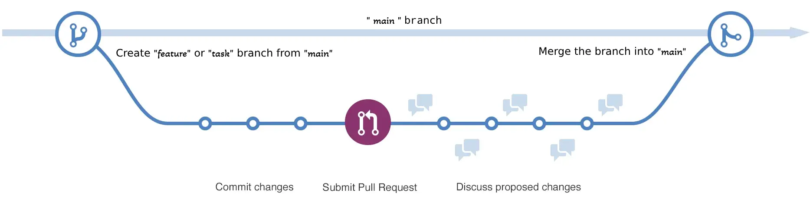
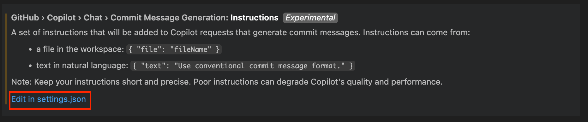
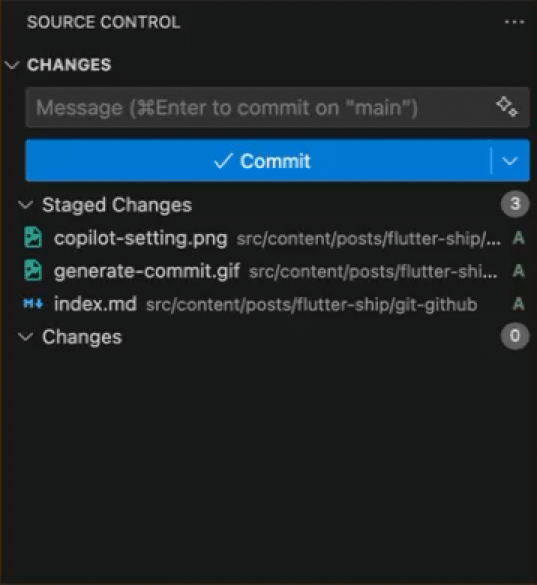

:::note[Updated]
This post has been updated at **2 September 2025** with improved Git hook and PR Checks configurations.
:::

# Overview

More than two decades ago, **Git** emerged as a version control system (**VCS**) to facilitate teamwork and track changes in a version history. Nowadays, Git is an essential tool for software developers, especially for those working in a team. Complementing Git, platforms like **GitHub** provide hosting for Git repositories, enabling collaboration and sharing.

In this post, I will show you how to setup a **production-ready Git & GitHub workflow** for your project. As you may know, this article is a part of the [**Flutter Ship**](../) series, which guides you in shipping a production-ready Flutter app. However, these principles can be applied to **any language or framework**.

By the end of this article, you will learn the following:

1.  How to implement a simple but effective **branching strategy**.
2.  How to adopt a **commit message standard** for a clean history and automated changelogs.
3.  How to automatically generate and manage **project changelogs**.
4.  How to use **Git hooks** to automate local checks, like formating & linting files, linting commits, and running tests.
5.  How to implement a **GitHub PR Checks** with **GitHub Actions** to automate your workflow.

If this sounds like what you're looking for, let's dive in!

# Branch Strategy

A clear branching strategy is essential for any software project to prevent the chaos of direct commits to the `main` branch. Working directly on `main` can lead to frequent merge conflicts, broken builds, and lost code, especially in a team setting.

The solution is to use short-lived branches for every new piece of work, whether it's a feature, bugfix, or chore. While there are many branching strategies, I recommend a strategy based on the popular and straightforward **[GitHub Flow](https://docs.github.com/en/get-started/using-github/github-flow)**. It's simple to understand, promotes continuous delivery, and works exceptionally well for most projects.

The core idea is illustrated below:



**Branch Types Explained**

- **Main Branch (`main`)**: This is the stable branch that always reflects the latest production-ready state of your project. All releases and deployments are made from here.
- **Feature branches (`feature-*` or `task-id-*`)**: Used for developing new features, enhancements, bug fixings or tasks. If you use a task management tool (like Jira), you can integrate with it and name your branch after the task or ticket ID (e.g., `ab-123-add-login`). Each feature/task branch is short-lived and merged back into `main` via a pull request after review and testing.

This model also supports different development environments with ease. When you complete a feature or task, you open a pull request (**PR**). You can configure a GitHub Action (or any other CI/CD service) to run tests and automate the generation of **APK**s for Android and **IPA**s for iOS, and distribute them to testers or users via your chosen platforms. I’ll cover _Flutter Continuous Delivery (CD)_ in detail in a future article.

:::tip[Git & Github Cheat Sheet]
I assume you already know the basics of Git and GitHub, so I won’t include basic Git commands here. If you need a refresher, check out my [Git & GitHub Cheatsheet](../../git-github-cheat-sheet/) article.
:::

:::important[Git Merge Recommendation]
If you merge branches locally, `merge --no-ff` is highly recommended. The `--no-ff` flag causes the merge to always create a new commit object, even if the merge could be performed with a fast-forward. This avoids losing information about the historical existence of a feature branch and groups all commits that together added the feature.
:::

# Commit Messages

Commit messages are your working history. While the probability of reading them is low, they are still valuable for maintaining a good commit history and understanding changes later on. At least once in a while, you need to read the history to get more details about an emerging issue. Furthermore, in most software projects, the **changelog** will be generated based on those commit messages to show the release changes between versions. So what could you find or generate if you have the following history?

```bash title="git log --graph --online"
* 4dcd0dc fix color
* 1e0acd7 fix issue
* 897cab6 Merge branch 'add-comment'
|\  
| * 7b2c3f3 integration
|/  
* 3d0b48d add feature
* 7287225 updated
* 1405829 update post
* dba0ea9 add post
```

To have team-level agreed standards for git commit messages, I highly recommend following **[Conventional Commits](https://www.conventionalcommits.org)**. 

```bash title="Conventional Commit Message Structure"
<type>[optional scope]: <description>

[optional body]

[optional footer(s)]
```

Check out the following example that uses **conventional commit** messages, which are much easier to understand and allow you to easily generate **changelogs**:

```bash title="git log --graph --online"
* 4dcd0dc Update themeColor fixed property to true
* 1e0acd7 fix(comment): Update check script to include biome CI
* 897cab6 Merge branch 'add-comment'
|\  
| * 7b2c3f3 feat(comment): Integrate Giscus for comments and add styles
|/  
* 8cbd821 fix(dependencies): Update astro and biome versions in pnpm-lock.yaml
* 3d0b48d feat: Add support for rendering mermaid codes in the markdown files
* 7287225 ci: Update code quality job
* 1405829 refactor(post): Update muslim data post and released
* dba0ea9 feat(post): Add the first draft of muslim data post
* 31a1ef8 build: Remove astro compress
```

:::tip[Commit Structure]
I highly recommend you to read the **[Conventional Commits](https://www.conventionalcommits.org)** documentation to get more information about the commit structure like type, scope, description, body, footer, and breaking changes.
:::

## AI-Generated Commit Messages

There are many tools that can help you write better conventional commits, and there are also AI tools to generate them. I used to test various tools to create commit messages, but recently I started using **GitHub Copilot** to generate conventional commit messages. By default, Copilot doesn't generate conventional commit messages, so we need to set a custom prompt in the settings.

### VSCode Copilot Configuration for Commit Messages

If you're using VS Code with workspace-based settings, you can find the settings file at `your-project > .vscode > settings.json`. 

For user-based settings, navigate to: `Settings > Extensions > GitHub Copilot Chat > Commit Message Generation` as attached below:


After you find the settings, add the following prompt to generate conventional commit messages:

```json title="settings.json"
// ...existing settings

"github.copilot.chat.commitMessageGeneration.instructions": [  
  {
    "text": "Generate a commit message that MUST follow the Conventional Commits format (feat, fix, docs, style, refactor, test, perf, build, ci, chore, revert). Include a brief description of the change in the subject line (under 72 characters) and a summarized explanation in the body, if necessary. Separate the subject and body with a blank line. Example: 'feat(auth): Add forgot password functionality to the login screen' or 'fix(products): Fix date format in the product list'."
  }
]

// ...existing settings
```
You can update the above prompt based on your needs. Now you can generate it with one click! 🎉



:::warning[Always Review AI Suggestions]
AI-generated messages are a helpful starting point, but they aren't always perfect. Always review and refine the message for accuracy and clarity before committing.
:::

### Alternative Tools

Besides **GitHub Copilot**, here are other popular tools for conventional commits:

- **[Commitizen](https://github.com/commitizen-tools/commitizen)**: Interactive CLI tool that helps you to create conventional commits, auto bump versions and auto changelog generation.
- **[Conventional Commits VS Code Extension](https://marketplace.visualstudio.com/items?itemName=vivaxy.vscode-conventional-commits)**: GUI helper for VS Code users.
- **[Cocogitto](https://github.com/cocogitto/cocogitto)**: The Conventional Commits toolbox.
- **[AI Commits](https://github.com/Nutlope/aicommits)**: A CLI that writes your git commit messages for you with AI.
- **More**: You can find more on the [conventional commits](https://www.conventionalcommits.org/en/about/) about page.

# Changelog

A `CHANGELOG.md` is a way to tell your consumers what has changed between versions. One of the most effective ways to do this is to generate it based on your git commit messages, which contain all your change history. There are many tools for generating changelogs, but one of my favorite tools is **[Git Cliff](https://git-cliff.org)**, which is a highly customizable changelog generator. It only takes three simple steps from installation to generation, as explained below:

## Setup Git Cliff

1. **Installation**: It supports most package managers, so you can find your preferred one [here](https://git-cliff.org/docs/installation). I use macOS, so I installed it via Homebrew:

```bash title="Install Git Cliff"
brew install git-cliff
```

2. **Initialization**: After installation, navigate to your project and initialize it by running the following command, which creates a file named `cliff.toml` for further customization:

```bash title="Initialize Cliff"
git-cliff --init
```

3. **Generate**: Finally, it's ready to generate a changelog by running the following command:

```bash title="Generate CHANGELOG.md"
git-cliff -o CHANGELOG.md
```

That's all you need to generate a changelog! [Here's an example](https://github.com/my-prayers/muslim-data-flutter/blob/main/CHANGELOG.md) that has been generated by **Git Cliff**. If you need any further customization, you can simply open and edit the `cliff.toml` file.

## Common Customizations

I've picked some useful customizations from the `cliff.toml` to explain here:

### 1. Update the header & footer description

```toml title="cliff.toml"
[changelog]
# template for the changelog header
header = """
# Changelog\n
All notable changes to this project will be documented in this file.\n
"""

# template for the changelog footer
footer = """
<!-- generated by git-cliff -->
"""
```

### 2. Support conventional and non-conventional commits

```toml title="cliff.toml"
[git]
# parse the commits based on https://www.conventionalcommits.org
conventional_commits = true
# filter out the commits that are not conventional
filter_unconventional = true
# process each line of a commit as an individual commit
split_commits = false
```

### 3. Customize group ordering

```toml title="cliff.toml" {7}
# regex for parsing and grouping commits
commit_parsers = [                                            # Group Ordering
  { message = "^feat", group = "<!-- 0 -->🚀 Features" },     # 0 
  { message = "^fix", group = "<!-- 1 -->🐛 Bug Fixes" },     # 1
  { message = "^doc", group = "<!-- 3 -->📚 Documentation" }, # 3
  { message = "^perf", group = "<!-- 4 -->⚡ Performance" },   # 4
  { message = "^refactor", group = "<!-- 2 -->🚜 Refactor" }, # 2 <- ordered to 2
  { message = "^style", group = "<!-- 5 -->🎨 Styling" },
  { message = "^test", group = "<!-- 6 -->🧪 Testing" },
  # ...
]
```

### 4. Skip specific commit groups

```toml title="cliff.toml" {8}
# regex for parsing and grouping commits
commit_parsers = [
  # ...
  { message = "^perf", group = "<!-- 4 -->⚡ Performance" },
  { message = "^refactor", group = "<!-- 2 -->🚜 Refactor" },
  { message = "^style", group = "<!-- 5 -->🎨 Styling" },
  { message = "^test", group = "<!-- 6 -->🧪 Testing" },
  { message = "^chore\\(release\\)", skip = true }, # <-- skipped group
  # ...
]
```

### 5. Sort commits by date

```toml title="cliff.toml"
# Organize commits within sections by oldest or newest order
sort_commits = "oldest"
```

For more advanced customizations, check out the [Git Cliff documentation](https://git-cliff.org/docs/).

# Git Hooks

> Git hooks are scripts that automatically execute before or after specific Git actions, like committing, pushing, or merging. They allow you to customize Git's behavior, automate tasks, enforce policies, and streamline your workflow. [read more](https://githooks.com)

We can take advantage of Git hooks to automate the following tasks:

1.  **pre-commit**: Before a commit is created.
    -   Apply `dart fix` to automatically fix issues.
    -   Apply `dart format` to reformat staged files.
    -   Run the Flutter linter to check for analysis issues.
2.  **commit-msg**: After a commit message is written, but before the commit is created.
    -   Validate the commit message to ensure it follows the Conventional Commits standard.
3.  **pre-push**: Before pushing code to a remote repository.
    -   Run all Flutter tests to prevent pushing broken code.

:::tip[Keep Git Hooks Fast and Reliable]
Regarding the **pre-push** hook, if you have a large test suite that makes your `git push` command too slow, you can skip this hook and set up a **PR check** in your CI/CD pipeline as an alternative.
:::

## The Challenge with Manual Git Hooks

While you can set up hooks manually by placing executable scripts (e.g., `pre-commit`) in your project's `.git/hooks/` directory, this approach has drawbacks. The `.git` directory is not version-controlled, so hooks are not shared across your team. Each developer must set them up manually, and keeping them updated is a maintenance burden. A Git hook manager solves these problems.

## Git Hook Management with Lefthook

There are many hook managers available, but since there isn't one made specifically for Dart, we'll use a language-agnostic tool that works with any project: [**Lefthook**](https://lefthook.dev). It's fast, powerful, and what I use in my own Flutter projects.

To get started, install Lefthook using your preferred package manager and run `lefthook install` in your project's root directory. This command creates a `lefthook.yaml` configuration file and installs the hooks into your `.git` directory.

:::tip
I highly recommend reading the [Lefthook documentation](https://lefthook.dev) before proceeding.
:::

## Lefthook Configuration

Let's configure `lefthook.yaml` to run the tasks we outlined earlier.

### pre-commit: Fix, Format, and Lint

This hook will run three commands in parallel on your staged Dart files before every commit.

```yaml title="lefthook.yaml" {5,8,10,15,21} collapse={12-23}
pre-commit:
  parallel: true
  commands:
    auto-fix:
      run: dart fix --apply && git add {staged_files}
    pretty:
      glob: '*.dart'
      run: dart format {staged_files} && git add {staged_files}
    linter:
      run: flutter analyze {staged_files}

commit-msg:
  commands:
    validate:
      run: 'scripts/validate_commit_msg.sh'

pre-push:
  parallel: true
  commands:
    tests:
      run: flutter test
```

### commit-msg: Validate Commit Message

Validating a commit message against the **Conventional Commits** specification is too complex for a single-line command, so we'll use an external script.

First, create the validation script in this path: `scripts/validate_commit_msg.sh`.

```bash
// filepath: scripts/validate_commit_msg.sh
#!/bin/bash

# Path to the commit message file
COMMIT_MSG_FILE=".git/COMMIT_EDITMSG"

# Check if the commit message file exists
if [ ! -f "$COMMIT_MSG_FILE" ]; then
  echo "Commit message file does not exist."
  exit 1
fi

# Read the commit message
COMMIT_MSG=$(cat "$COMMIT_MSG_FILE")

# Get the first line of the commit message
FIRST_LINE=$(echo "$COMMIT_MSG" | head -n 1)

# Define the Conventional Commits regex pattern
# Scope cannot contain spaces - only letters, numbers, hyphens, and underscores
PATTERN='^(feat|fix|build|chore|ci|docs|style|refactor|perf|test)(\([a-zA-Z0-9_-]+\))?(!)?: .+'

# Validate the commit message format
if [[ ! "$FIRST_LINE" =~ $PATTERN ]]; then
  echo "👎 Invalid commit message format."
  echo "Commit message should follow the Conventional Commits format:"
  echo "  <type>(<scope>): <description>"
  echo "  - type: feat, fix, build, chore, ci, docs, style, refactor, perf, test"
  echo "  - scope: optional, no spaces allowed (use hyphens or underscores instead)"
  echo "  - description: brief description"
  echo ""
  echo "Examples:"
  echo "  ✅ feat(user-auth): Add new authentication method"
  echo "  ✅ fix(api_client): Fix connection timeout issue" 
  echo "  ❌ fix(my feature): Fix some bug (scope contains spaces)"
  exit 1
fi

# Check if the first line is no more than 72 characters
if [ ${#FIRST_LINE} -gt 72 ]; then
  echo "👎 Commit message first line is too long (${#FIRST_LINE} characters)."
  echo "Please keep the first line to 72 characters or less."
  exit 1
fi

echo "👍 Valid commit message!"
exit 0
```

Next, make the script executable:

```bash 
chmod +x scripts/validate_commit_msg.sh
```

Finally, add the `validate-commit-msg` script to your `lefthook.yaml`:

```yaml title="lefthook.yaml" {5,8,10,15,21} collapse={1-10, 17-23}
pre-commit:
  parallel: true
  commands:
    auto-fix:
      run: dart fix --apply && git add {staged_files}
    pretty:
      glob: '*.dart'
      run: dart format {staged_files} && git add {staged_files}
    linter:
      run: flutter analyze {staged_files}

commit-msg:
  commands:
    validate:
      run: 'scripts/validate_commit_msg.sh'

pre-push:
  parallel: true
  commands:
    tests:
      run: flutter test
```

### pre-push: Run Tests

This hook runs all Flutter tests before you push. The push will be blocked if any tests fail.

```yaml title="lefthook.yaml" {5,8,10,15,21} collapse={1-15}
pre-commit:
  parallel: true
  commands:
    auto-fix:
      run: dart fix --apply && git add {staged_files}
    pretty:
      glob: '*.dart'
      run: dart format {staged_files} && git add {staged_files}
    linter:
      run: flutter analyze {staged_files}

commit-msg:
  commands:
    validate:
      run: 'scripts/validate_commit_msg.sh'

pre-push:
  parallel: true
  commands:
    tests:
      run: flutter test
```

After you completed the configuration, you need to rerun the `lefthook install` to resync the git hooks. With this setup, your local development workflow is now automated to enforce code quality and consistency.

# GitHub PR Checks

> **GitHub Actions** is a continuous integration and continuous delivery (CI/CD) platform that allows you to automate your build, test, and deployment pipeline. You can create workflows that build and test every pull request to your repository, or deploy merged pull requests to production. [read more](https://docs.github.com/en/actions/get-started/understanding-github-actions)

:::tip
If you are new to CI/CD, I highly recommend reading the [GitHub Actions](https://docs.github.com/en/actions/get-started/understanding-github-actions) documentation to get familiar with the core concepts.
:::

Local Git hooks are great for immediate feedback, but they can be bypassed with a simple `--no-verify` flag. To guarantee that every commit merged into main follows the **Conventional Commits** standard, passes **Flutter analyze** and has no **failing tests**, we can set up a **GitHub Actions** workflow to run these validations automatically whenever a **PR** is opened against the `main` branch.


For the **Flutter analyze** and **Flutter test** steps, we need a common Flutter setup. To avoid duplicating this setup code, we can use [GitHub Composite actions](https://docs.github.com/en/actions/tutorials/create-actions/create-a-composite-action). Let's create a composite action to set up the Flutter environment. First, create a `.github/actions/setup-flutter` directory in the root of your project. Inside that directory, create a file named `action.yaml` with the following content:

```yaml
// filepath: .github/actions/setup-flutter/action.yaml
name: "Setup Flutter"
description: "Setup Flutter with dependencies"
runs:
  using: "composite"
  steps:
    - name: Set up Flutter
      uses: subosito/flutter-action@v2
      with:
        channel: stable
        flutter-version-file: pubspec.yaml
    - name: Install dependencies
      run: flutter pub get
      shell: bash
```

Then let's create the **PR checks workflow**. First, create a `.github/workflows` directory in the root of your project. Inside that directory, create a file named `pull_request.yaml` with the following content:

```yaml
// filepath: .github/workflows/pull_request.yaml
name: Flutter PR Checks

on:
  pull_request:
    branches:
      - main

jobs:
  commitlint:
    runs-on: ubuntu-latest
    name: Conventional Commitlint
    permissions:
      pull-requests: read
    steps:
      - name: Conventional Commitlint
        uses: opensource-nepal/commitlint@v1

  analyze:
    runs-on: ubuntu-latest
    name: Flutter Analyze
    needs: commitlint
    steps:
      - name: Checkout code
        uses: actions/checkout@v4
      - name: Setup Flutter
        uses: ./.github/actions/setup-flutter
      - name: Analyze code
        run: flutter analyze

  test:
    runs-on: ubuntu-latest
    name: Flutter Tests
    needs: analyze
    steps:
      - name: Checkout code
        uses: actions/checkout@v4
      - name: Setup Flutter
        uses: ./.github/actions/setup-flutter
      - name: Run tests
        run: flutter test
```
This workflow ensures that every pull request is automatically checked for code quality and passing tests before it can be merged, preventing broken code from reaching your `main` branch.

## More Advanced Checks

While our current workflow is robust, you can further enhance code quality and security by enabling additional checks on GitHub.

### 1. Codecov Integration

Code coverage metrics help you understand how much of your codebase is tested. **Codecov** is a popular service that visualizes coverage reports, tracks changes over time, and provides PR feedback about coverage changes.

To integrate Codecov with your Flutter project, update the `test` job in your workflow:

```yaml
  test:
    runs-on: ubuntu-latest
    name: Flutter Tests
    needs: analyze
    steps:
      - name: Checkout code
        uses: actions/checkout@v4
      - name: Setup Flutter
        uses: ./.github/actions/setup-flutter
      - name: Run tests with coverage
        run: flutter test --coverage
      - name: Upload coverage to Codecov
        uses: codecov/codecov-action@v3
        with:
          token: ${{ secrets.CODECOV_TOKEN }}
          file: ./coverage/lcov.info
          fail_ci_if_error: false
```
After setting this up and connecting your repo to codecov.io, you'll get detailed coverage reports on each pull request, helping maintain or improve test coverage as your codebase evolves.

### 2. Automated Dependency Management with Dependabot

Keeping dependencies up-to-date is crucial for security and accessing new features. GitHub's **Dependabot** automates this process by:
-   **Security Updates**: Automatically creating pull requests to update vulnerable dependencies as soon as they are discovered.
-   **Version Updates**: Regularly checking for new versions of your dependencies and creating PRs to keep them current.

You can enable and configure Dependabot by creating a `dependabot.yaml` file in your `.github` directory. Here's a basic configuration for a Flutter project:

```yaml
// filepath: .github/dependabot.yaml
version: 2
updates:
  - package-ecosystem: "pub"
    directory: "/"
    schedule:
      interval: "weekly"
      day: "sunday"
      time: "00:00"
      timezone: "Asia/Baghdad"
    target-branch: "main"
    labels:
      - "dependencies"
```

This is a basic configuration example. For more advanced setups, you can [optimize](https://docs.github.com/en/code-security/dependabot/dependabot-version-updates/optimizing-pr-creation-version-updates) and [customize](https://docs.github.com/en/code-security/dependabot/dependabot-version-updates/customizing-dependabot-prs) Dependabot's behavior.

### 3. Implement Branch Protection Rules

Branch protection rules are a powerful GitHub feature that prevents direct pushes to important branches like `main` and enforces quality gates for pull requests. You can configure them in your repository settings under **Settings > Branches > Add branch ruleset**.

**Key rules include**:
-   **Require status checks to pass**: This is essential. It forces your `Analyze & Test` workflow (and any others) to succeed before a PR can be merged.
-   **Require a pull request before merging**: Disallows direct pushes to `main` and forces all changes to go through a review process.
-   **Require signed commits**: Ensures that commits are from a verified source, enhancing security.

By combining your CI workflow with these advanced checks, you create a nearly foolproof system for maintaining a high-quality, secure, and stable codebase.

# Source Code 

To see all the concepts from this article implemented in a real Flutter project, check out the **[Simple Todo App](https://github.com/kosratdev/simple_todo)** repository. Switch to the `01-git-github-workflow` branch to see all in action.

```bash
# Clone and explore the implementation
git clone https://github.com/kosratdev/simple_todo.git
cd simple_todo
git checkout 01-git-github-workflow

# Install Lefthook and see the hooks in action
lefthook install
```

This repository serves as a practical reference for implementing everything we covered in this article. Feel free to fork it and use it as a starting point for your own Flutter projects!

---

We've covered a lot of ground in this article, from establishing a solid branching strategy to automating our entire workflow. By implementing **GitHub Flow**, **Conventional Commits**, automated **changelogs** with **Git Cliff**, local quality checks with **Lefthook**, and a basic CI pipeline with **GitHub Actions**, you've built a robust foundation for any Flutter project.

This setup isn't just about following rules; it's about creating a predictable, high-quality, and efficient development process. It ensures that every piece of code is consistent, tested, and ready for collaboration, freeing you up to focus on what matters most: building great features.

This is just the beginning of our journey. In the next article of the [**Flutter Ship**](../) series, we'll take this foundation and build upon it by setting up different **flavors** for different environments.

I hope this guide has been helpful. If you have any questions, suggestions, or want to share your own workflow tips, please leave a comment below.

`Happy coding!🚀`