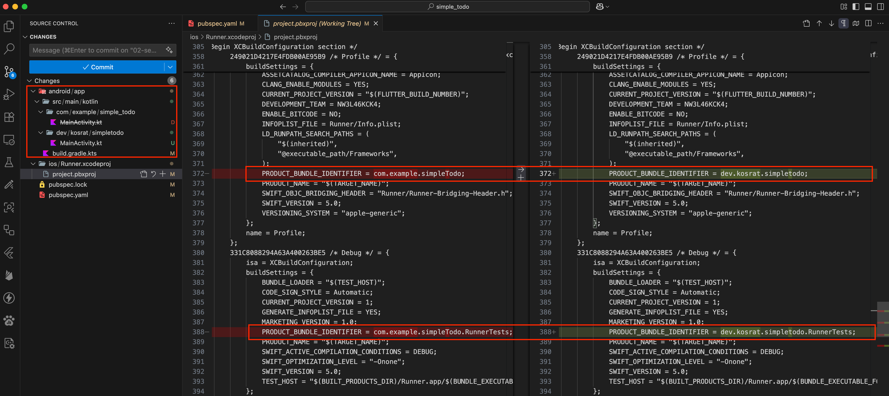
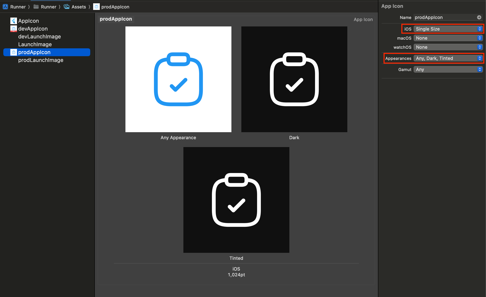

# Overview

> "Give me six hours to chop down a tree and I will spend the first four sharpening the axe."
> — Abraham Lincoln

// TODO: to be reviewed again after the article has been done.

After setting up the [Git & GitHub Workflow](../git-github/), it is time to sharpen the axe. Setting up the coding enviroment is one of first crucial steps that should be done in the early stages of development. While the steps we'll cover in this article may seem small, they have a significant impact on your project and lay the foundation for the up articles in this series.

In this post, I will show you how to setup a complete project environment including **package & bundle IDs, flavors, app icons, splash screens, and environment variables** for your Flutter project. As you know, this article is part of the [**Flutter Ship**](../) series, which guides you through shipping a production-ready Flutter app.

By the end of this article, you will learn the following:

1. How to change your app's **package and bundle ID** for proper identification.
2. How to set up different **flavors** for development, staging, and production environments.
3. How to configure different **app icons** for each flavor.
4. How to design and implement **splash screens** for different versions of Android and iOS.
5. How to use **environment variables** (`.env` files) to manage configuration across environments.

If this sounds like what you're looking for, let's dive in!

# Linter & Formatter

```yaml title="analysis_options.yaml
include: package:flutter_lints/flutter.yaml

linter:
  rules:
    always_declare_return_types: true
    avoid_redundant_argument_values: true
    unawaited_futures: true
    prefer_final_in_for_each: true
    prefer_final_locals: true
    cancel_subscriptions: true
    close_sinks: true
    combinators_ordering: true
    comment_references: true
    one_member_abstracts: true
    use_super_parameters: true
    prefer_const_constructors: true
    prefer_const_declarations: true
    prefer_const_literals_to_create_immutables: true
```

# Package Name & Bundle ID

When you create a Flutter project, it sets the Android package name and iOS bundle ID to `com.example.your_project` by default, which can't be shipped to production. Package names and bundle IDs must be unique and should preferably follow your domain in reverse order with your project name (e.g., `com.yourcompany.yourapp`). Once published, you can't change them unless you create an entirely new app listing.

Changing the bundle ID in iOS is easier than changing the package name in Android because Android creates nested folder structures for each part of the package name.

I recommend changing the package name and bundle ID at the beginning of the project because we'll configure other components based on them like **flavors**, **monitoring tools**, and **analytics**. Changing them later means redoing this work and the others that depends on it.

Fortunately, the [change_app_package_name](https://pub.dev/packages/change_app_package_name) package makes this process quick and easy. After changing the identifiers, you can remove the package from your dependencies since it's no longer needed.

## Steps to Change Package name & Bundle ID: 

### 1. Install the package

```bash title='Package Installation'
flutter pub add -d change_app_package_name
```

### 2. Change the Package Name and Bundle ID

Replace `com.new.package.name` with your actual package identifier:

```bash title='Change Package Name and Bundle ID'
dart run change_app_package_name:main com.new.package.name
```

That is it! The identifiers are now changed. Check your file changes and run the app to verify the changes. I've also updated the **[Simple Todo](https://github.com/kosratdev/simple_todo/commit/018af488913d9bb7321e24037457286dd481d78f)** app with this change. Here are the files that were modified: 



:::tip[Platform-Specific Changes]
You can change the package name for only one platform by adding the `--android` or `--ios` flag to the command. This is useful if you need different identifiers for each platform.
:::

### 3. Remove the package dependancy

After changing the identifiers, we no longer need the package, so we can remove it:

```bash title='Remove the Dependency'
flutter pub remove change_app_package_name
```

Now your app has proper identifiers and is ready for the next configuration steps!


# Flavors

Flutter flavor is a technique that allows developers to have multiple distinct version of an app from the single codebase. Each flavor has own unique configurations settings, behaviours, and assets. It's ideal to manage different app environments like (development, staging, and production) and app variations like – free and primium from the single codes base. 

:::warning[flavorizr Notes]
I've tried []() package to manage and create flavors and the pointed my observations on it below: 
- It doesn't support iOS 
:::

Steps
1. Export images from the Figma file by selecting all the icons and then export them with 1024 x 1024 px
2. Add the exported icons to the asset folder
3. Add flavorizr config
```yaml title="flavorizr.yaml"
flavors:
  dev:
    app:
      name: "DEV Todo"

    android:
      applicationId: "dev.kosrat.simpletodo.dev"
      icon: "assets/app_icons/android/dev/legacy.png"
      adaptiveIcon:
        foreground: "assets/app_icons/android/dev/foreground.png"
        background: "assets/app_icons/android/dev/background.png"
        monochrome: "assets/app_icons/android/dev/monochrome.png"

    ios:
      bundleId: "dev.kosrat.simpletodo.dev"

  prod:
    app:
      name: "Simple Todo"

    android:
      applicationId: "dev.kosrat.simpletodo"
      icon: "assets/app_icons/android/prod/legacy.png"
      adaptiveIcon:
        foreground: "assets/app_icons/android/prod/foreground.png"
        background: "assets/app_icons/android/prod/background.png"
        monochrome: "assets/app_icons/android/prod/monochrome.png"

    ios:
      bundleId: "dev.kosrat.simpletodo"
```
4. Run `flutter pub run flutter_flavorizr`
5. Set iOS app icons: go to assets > devAppIcon > change the following App Icon properties: iOS > Single Size and Appearances > Any, Dark, Tinted. After that upload icons.
   
6. Test different flavors on Android: `flutter run --flavor dev` or `flutter run --flavor prod`. Test material U 
7. Test different flavors on iOS: `flutter run --flavor dev` or `flutter run --flavor prod`. Test different icon modes light, dark, and tinted.
TODO: Show the different app icons here.  
8. It creates flavor class with flavor banner, you can remove it if you want. 
9.  Add vscode launch configuration: add `launch.json` file to the `.vscode` folder with the following configuration: 
```json
{
  "version": "0.2.0",
  "configurations": [
    {
      "name": "Dev Debug",
      "request": "launch",
      "type": "dart",
      "args": ["--flavor", "dev"]
    },
    {
      "name": "Dev Profile",
      "request": "launch",
      "type": "dart",
      "args": ["--flavor", "dev"],
      "flutterMode": "profile"
    },
    {
      "name": "Dev Release",
      "request": "launch",
      "type": "dart",
      "flutterMode": "release",
      "args": ["--flavor", "dev"]
    },
    {
      "name": "Prod Debug",
      "request": "launch",
      "type": "dart",
      "args": ["--flavor", "prod"]
    },
    {
      "name": "Prod Profile",
      "request": "launch",
      "type": "dart",
      "flutterMode": "profile",
      "args": ["--flavor", "prod"]
    },
    {
      "name": "Prod Release",
      "request": "launch",
      "type": "dart",
      "flutterMode": "release",
      "args": ["--flavor", "prod"]
    }
  ]
}
```

# Splash Screen

Steps 
1. Add `flutter_native_splash: 2.4.6` to the dev dependencies
2. Export logo in the Figma with 4x size 1152 x 1152 px. 
3. Add the following config to the `flutter_native_splash.yaml` file
```yaml title="flutter_native_splash.yaml"
flutter_native_splash:
  color: "#FFFFFF"
  image: assets/images/splash_logo_light.png
  color_dark: "#1E1E1E"
  image_dark: assets/images/splash_logo_dark.png

  android_12:
    color: "#FFFFFF"
    image: assets/images/splash_logo_light.png
    color_dark: "#1E1E1E"
    image_dark: assets/images/splash_logo_dark.png
```
4. run this command `dart run flutter_native_splash:create` 
5. that's it. Test on different platforms with different themes. 
TODO: Add sample images here.

# Environment Variables (`.env`) 

[What is the point to have the .env file?](https://github.com/java-james/flutter_dotenv/issues/36) 

Steps
1. Add `flutter_dotenv: 5.2.1` to the dependancy list
2. create `.env` file at the root folder
   ``` title=".env"
   BASE_URL="https://api.kosrat.dev"
   ```
3. Add to assets
```
assets:
  - .env
```
4. Initialize it in the main function
```dart collapse={1-6, 9-11}
import 'package:flutter/material.dart';
import 'package:flutter/services.dart';
import 'package:flutter_dotenv/flutter_dotenv.dart';

import 'app.dart';
import 'flavors.dart';

Future<void> main() async {
  F.appFlavor = Flavor.values.firstWhere(
    (element) => element.name == appFlavor,
  );

  await dotenv.load(fileName: ".env");

  runApp(const App());
} 
```
5. Access to the env variables at run time. 
```dart
final baseUrl = dotenv.getBool('BASE_URL', fallback: 'https://example.com');
```
Flavor support? 
1. add `.env.dev` to the root folder
2. Add the following extension to load different env files based on the targeted flavor.
```dart
//filepath: lib/utils/flavor_env.dart
import 'package:flutter_dotenv/flutter_dotenv.dart';

/// Extension on the `DotEnv` class to provide additional functionality
/// specific to handling environment variables for different flavors of
/// the application.
extension FlavorEnv on DotEnv {
  /// Loads the specified [appFlavor] configuration asynchronously.
  Future<void> loadFlavor(String? appFlavor) async {
    switch (appFlavor) {
      case 'dev':
        await load(fileName: '.env.dev');
        break;
      case 'prod':
        await load(fileName: '.env');
        break;
      default:
        throw Exception('Unknown flavor');
    }
  }
}
```
1. Call the new extension method to initialize it in the main function.
```dart
// Load the .env file into the dotenv based on the selected flavor.
await dotenv.loadFlavor(appFlavor);
```
Type safety 
Add another extension to call the env variables by class-based key values instead of write the variable keys manually. 
```dart
//filepath: lib/utils/env_extension.dart
import 'package:flutter_dotenv/flutter_dotenv.dart';

/// Extension on `DotEnv` to provide getters for environment keys.
extension EnvKey on DotEnv {
  String get baseUrl => get('BASE_URL', fallback: 'https://example.com');
}
```
Now you can access it like that `dotenv.baseUrl` which is much easier but you need to add the variables to the extension function when you update or add a new env variable. 

# Update gitignore

# Source Code

# References